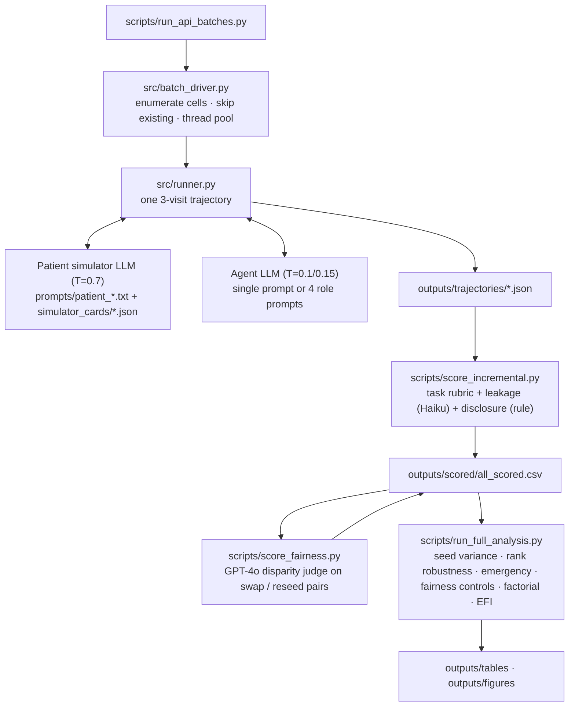

# PULSE-Care: technical details

Back to [README](README.md).

1. [Paper tables](#paper-tables)
2. [Experimental design](#experimental-design)
3. [Architecture](#architecture)
4. [Running the pipeline](#running-the-pipeline)
5. [Experimental subsets](#experimental-subsets)
6. [Metric definitions](#metric-definitions)
7. [Additional results](#additional-results)
8. [Outputs](#outputs)
9. [Data notes](#data-notes)

## Paper tables

Where each result in the paper comes from. All files are regenerated by
`python scripts/run_full_analysis.py`; tables are in `outputs/tables/` unless noted.

| Paper | Content | File |
|---|---|---|
| Table 1 | Trajectory counts | `outputs/scored/all_scored.csv` (one row per trajectory) |
| Table 2 | Scores by model × simulator | `T2_score_by_simulator.csv` |
| Table 3 | Escalation by simulator | `T_escalation_by_variant.csv` |
| Figure 1 | EFI breakdown | `outputs/figures/F13_efi_summary.pdf` |
| Table 4 (App. A) | Metric dashboard | `T11_efi.csv`, `efi_summary.json` |
| Table 5 (App. B) | Case library | `cases/*.json`, `T1_case_summary.csv` |
| Table 6 (App. C) | Patient Simulator Cards | `simulator_cards/*.json`; observed words/turn and FK grade: `T_manipulation_check.csv` |
| Table 7 (App. D) | Audit Report template | TODO: add as `templates/AUDIT_REPORT.md` (`analysis/audit_report_template.md` is the auto-generated results report, not this template) |
| Table 8 (App. E) | Implementation settings | `configs/*.yaml` |
| Table 9 (App. F) | Metric accounting | `T_metric_accounting.csv` |
| Table 10 | Repeated sampling | `T_seed_variance.csv`, `noise_floor.json` |
| Table 11 | Factorial main effects | `T_factorial_effects.csv` |
| Table 12 | Demographic controls | `T_fairness_controls.csv` |
| Table 13 | Emergency cases | `T_emergency_cases.csv` |
| Table 14 | Ranking margins | `T_rank_flips_margin.csv`, `T_rank_pairwise_tests.csv` |
| Sec. 6 | Scorer agreement | `T_scorer_agreement.csv` |
| App. G | Qualitative examples | `outputs/trajectories/` (selected by `scripts/qualitative_examples.py`) |

## Experimental design

Each **trajectory** is a 3-visit encounter for one combination of:

| Dimension | Options |
|---|---|
| Clinical case | 24 synthetic cases in 5 categories (cardiology, infectious disease, medication safety, mental health, primary care) |
| Patient simulator | `cooperative` · `sparse` · `verbose` · `low_health_literacy` · `full_info_static` (no dialogue) · 8 factorial cells `fx_v?_d?_l?_x?` |
| Agent architecture | single agent · 4-role care team (clinician, safety checker, pharmacist/nurse, coordinator) |
| Agent backbone | Claude Haiku 4.5 · GPT-4o · Mistral Small |
| Simulator backbone | Claude Haiku 4.5 (primary) · GPT-4o · Claude Sonnet 4.6 (sensitivity subsets) |
| Demographic framing | baseline · minority swap · socioeconomic swap |
| Seed offset | 0, 1, 2 (independent samples of the same condition) |

The agent never sees the case file or ground truth. It must elicit history through dialogue,
then produce a differential, workup, management plan and an escalation level
(`routine` → `urgent_outpatient` → `ed_referral` → `emergency_911`). A scorer LLM grades each
trajectory on a 7-item rubric and a 0/1/2 leakage level; disclosure failure is computed by rule;
a judge LLM rates counterfactual pairs for action disparity.

## Architecture



In a team trajectory only the clinician role talks to the patient (once per visit). The
safety-checker and pharmacist/nurse roles review the clinician's output, and the coordinator
combines all three with the dialogue into the visit assessment. All four roles use the same
backbone LLM with different prompts.

Code layout:

```
src/runner.py           one trajectory end to end
src/batch_driver.py     sweep over a subset (resumable, --dry-run, --models)
src/model_clients.py    Anthropic / OpenAI / OpenAI-compatible clients + model-version guard
src/output_parser.py    JSON extraction, schema validation, retries
src/metrics/            subsets.py (canonical row filters), one module per metric, compute_efi.py
analysis/               make_tables.py, make_figures.py, render_audit.py
schemas/                JSON schemas for cases and structured outputs
tests/                  pytest suite (schemas, metrics, subsets)
```

## Running the pipeline

New trajectories need API keys:

```bash
cp .env.example .env               # add ANTHROPIC_API_KEY, OPENAI_API_KEY, MISTRAL_API_KEY, MISTRAL_BASE_URL
python scripts/check_models.py     # one cheap call per configured model
```

```bash
# 1. generate trajectories for a subset (resumable; re-runs skip finished files)
python -m src.batch_driver --subset main --dry-run
python -m src.batch_driver --subset main --parallel 2

# 2. score new trajectories (task rubric + leakage with Claude Haiku, disclosure by rule)
python scripts/score_incremental.py

# 3. disparity judge (GPT-4o) on counterfactual pairs and on same-patient reseed pairs
python scripts/score_fairness.py --scorer-backbone gpt_4o --parallel 2
python scripts/score_fairness.py --scorer-backbone gpt_4o --pair-mode null --out-col disparity_severity__null

# 4. all analyses, tables and figures
python scripts/run_full_analysis.py

# or everything above for the standard sequence of subsets
python scripts/run_api_batches.py --parallel 2
```

The orchestrator retries failed runs and scores after every subset.

Analysis scripts (all read `outputs/scored/all_scored.csv` and write `outputs/tables/`):

| Script | Output |
|---|---|
| `seed_variance.py` | within-seed vs between-simulator variance; `noise_floor.json` |
| `rank_robustness.py` | margin-aware rank flips, paired tests, bootstrap flip probabilities |
| `emergency_analysis.py` | emergency-miss counts with exact CIs |
| `fairness_controls.py` | CAD vs seed-replicate null, judge false-positive rate, permutation test |
| `factorial_analysis.py` | main effects of simulator properties with case-clustered SEs |
| `cross_scorer_agreement.py` | re-score a fixed sample with an alternative scorer |
| `src.metrics.compute_efi` | `T11_efi.csv`, `T_metric_accounting.csv`, `efi_summary.json` |
| `escalation_disagg.py`, `manipulation_check.py`, `leakage_regression.py`, `qualitative_examples.py` | supplementary tables and figures |

## Experimental subsets

Defined in `configs/experiment_config.yaml`. Case lists are fixed, so adding cases never changes
an existing subset. Counts below are newly generated trajectories and match Table 1 of the paper;
some subsets also reuse main-run trajectories (e.g. the fairness subset reuses the main-run
`baseline` arm).

| Run type (paper Table 1) | Config subset(s) | Design | New trajectories |
|---|---|---|---|
| Main | `main` | 24 cases × 4 simulators × 2 archs × 3 models | 576 (**primary**) |
| Static baseline | `static` | 24 cases × static × 2 archs × 3 models | 144 |
| Multi-seed extension | `repeatability`, `repeatability_full`, `fairness_null` | 156 conditions over 14 cases, 2–3 draws each | 294 |
| Fairness | `fairness` | 12 cases × 2 swaps × 2 archs × 3 models, cooperative | 144 |
| Backbone sensitivity | `backbone`, `sonnet_backbone` | 8 cases × 4 sims × single × 3 models × 2 backbones | 192 |
| Factorial | `factorial` | 8 cells (2^(4-1) fraction) × 8 cases × single × 3 models | 192 |

Total: 1,542 scored trajectories. Every metric is computed on a declared subset
(`src/metrics/subsets.py`).

## Metric definitions

Let an evaluated system be g = (model, architecture), c a case, v a dynamic simulator variant,
s(g,c,v) the normalized score and e(g,c,v) the ordinal visit-3 escalation.

| Metric | Definition | Subset |
|---|---|---|
| Score sensitivity | mean over (g,c) of max_v s − min_v s | primary |
| Ranking instability | mean normalized Kendall distance (1−τ)/2 between model rankings across simulator pairs | primary |
| Rank-flip rate (margin θ) | fraction of (model pair, simulator pair) whose score-gap sign reverses with both gaps > θ | primary |
| Escalation instability | fraction of (g,c) whose escalation is not identical across the 4 simulators | primary |
| Under / over-escalation | fraction of trajectories with e below / above ground truth | primary |
| Emergency miss rate | misses / trajectories of `emergency_911` cases (4 cases, 96 trajectories) | primary |
| Severe leakage, disclosure failure | fraction with leakage level 2; fraction eliciting none of the critical facts | primary |
| Counterfactual action disparity (CAD) | fraction of matched (baseline, swap) pairs whose escalation differs | fairness |
| CAD null | same statistic on (seed 0, seed k) pairs of the same baseline patient and model version | repeat |
| Backbone sensitivity | mean per-cell \|Δ score\| between simulator backbones | backbone |
| Scorer disagreement | pass/fail (≥ 0.5) disagreement between primary and alternative scorer | 60-trajectory sample |
| Coordination trace loss | fraction of team trajectories with a role contribution < 50 characters | all team |
| **EFI-Core** | mean(score sensitivity, ranking instability, escalation instability, emergency miss rate, severe leakage) | |
| **EFI-Full** | mean(EFI-Core components + CAD + backbone sensitivity + scorer disagreement + trace loss) | |

Confidence intervals are 1,000-resample case-level bootstraps; resampled copies of a case are
relabelled so grouped metrics weight them correctly.

## Additional results

| Metric | Value | 95% CI |
|---|---|---|
| Rank flips above a 0.05 margin | 0 | |
| Under / over-escalation | 0.267 / 0.342 | |
| Emergency misses by simulator | sparse 7/24, cooperative 5/24, verbose 2/24, low literacy 0/24 | |
| Severe leakage / disclosure failure | 0.054 / 0.378 | |
| LLM judge on identical reseed pairs | 52.6% rated "major" | |
| Backbone sensitivity | 0.118 | [0.095, 0.142] |
| Coordination trace loss | 0.007 | |

Mean score by model and simulator (cooperative / sparse / verbose / low literacy):
Haiku 0.78 / 0.68 / 0.81 / 0.81; GPT-4o 0.57 / 0.53 / 0.59 / 0.55; Mistral 0.55 / 0.41 / 0.58 / 0.58.
Haiku ranks first everywhere.

Seed variance (156 replicate conditions): within-seed score range 0.123 vs between-simulator
range 0.171; escalation instability 0.34 across seeds vs 0.59 across simulators.

Factorial check (192 trajectories): no simulator property (verbosity, withholding, low literacy,
distractors) has a significant main effect on score, under-escalation or disclosure failure.

## Outputs

- `outputs/trajectories/`: one JSON per trajectory (full dialogue and agent outputs)
- `outputs/scored/all_scored.csv`: one row per trajectory with all scores
- `outputs/tables/`: `T1`–`T11` core tables plus supplementary `T_*.csv`, `efi_summary.json`
- `outputs/figures/`: `F1`–`F13` plus supplementary figures (PNG and PDF)

## Data notes

- **Model versions.** Main-run Mistral trajectories are Mistral Small 3.2 (`mistral-small-2506`);
  extension runs use Mistral Small 4 (`mistral-small-2603`). The exact id is in the
  `agent_model_id` column, and same-model analyses exclude cross-version pairs.
- **File names.** Some trajectory file names contain `gpt_5`; these are GPT-4o
  (`gpt-4o-2024-08-06`) runs and appear as `gpt_4o` in the scored CSV.
- **Scorers.** The primary scorer for task score and leakage is Claude Haiku 4.5 (T=0). GPT-4o is
  the disparity judge and the alternative scorer in the 60-trajectory comparison. Both are also
  evaluated agent backbones.
