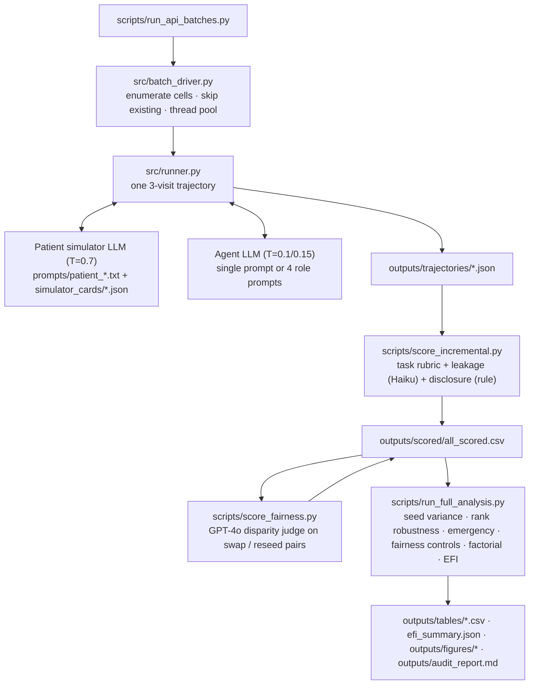

# PULSE-Care

**A measurement-validity audit framework for simulated-patient evaluation of clinical AI agents.**

PULSE-Care runs multi-visit clinical encounters between an AI agent and an LLM patient
simulator, scores them, and then asks whether the conclusions (scores, model rankings,
escalation decisions, demographic counterfactuals) stay stable when the patient simulator,
agent architecture, simulator backbone, scorer, or random seed changes. The output is a set of
measurement-validity metrics with case-level bootstrap intervals and two composite indices,
**EFI-Core** and **EFI-Full**.

---

## Contents

1. [What the system does](#what-the-system-does)
2. [Architecture](#architecture)
3. [Directory layout](#directory-layout)
4. [Setup](#setup)
5. [Running the pipeline](#running-the-pipeline)
6. [Experimental subsets](#experimental-subsets)
7. [Output tables and figures](#output-tables-and-figures)
8. [Metric definitions](#metric-definitions)
9. [Current results](#current-results)
10. [Data notes](#data-notes)

---

## What the system does

Each **trajectory** is a 3-visit encounter for one combination of:

| Dimension | Options |
|---|---|
| Clinical case | 24 synthetic cases in 5 categories (cardiology, infectious disease, medication safety, mental health, primary care); 6 further draft emergency cases are included but unused |
| Patient simulator | `cooperative` · `sparse` · `verbose` · `low_health_literacy` · `full_info_static` (no dialogue) · 16 factorial cells `fx_v?_d?_l?_x?` |
| Agent architecture | single-agent · 4-role care team (clinician, safety checker, pharmacist/nurse, coordinator) |
| Agent backbone | Claude Haiku 4.5 · GPT-4o · Mistral Small |
| Simulator backbone | Claude Haiku 4.5 (primary) · GPT-4o · Claude Sonnet 4.6 (sensitivity subsets) |
| Demographic framing | baseline · minority swap · socioeconomic swap |
| Seed offset | 0, 1, 2 (independent samples of the same condition) |

The agent never sees the case file or ground truth; it must elicit history through dialogue,
then emit a differential, workup, management plan, and an escalation level
(`routine` → `urgent_outpatient` → `ed_referral` → `emergency_911`). A scorer LLM grades each
trajectory on a 7-item rubric and a 0/1/2 leakage level; disclosure failure is computed
deterministically; a judge LLM rates counterfactual pairs for action disparity.

## Architecture



Inside a team trajectory the clinician role is the only one that talks to the patient (once per
visit); the safety-checker and pharmacist/nurse roles review the clinician's JSON; the
coordinator synthesises all three plus the dialogue into the visit assessment and an evidence
trace. All four roles are the same backbone LLM with different prompts.

## Directory layout

```
pulse-care/
├── configs/            experiment_config.yaml (subsets, frozen case lists), model_config.yaml, scoring_config.yaml
├── cases/              synthetic 3-visit case files (JSON, validated by schemas/case_schema.json)
├── simulator_cards/    patient-simulator behaviour cards (4 named variants + 16 factorial cells)
├── prompts/            simulator, agent, team-role, scorer and judge prompts
├── schemas/            JSON schemas for cases and structured outputs
├── src/
│   ├── runner.py                 one trajectory end to end
│   ├── batch_driver.py           sweep over a subset (resumable, --dry-run, --models)
│   ├── model_clients.py          Anthropic / OpenAI / OpenAI-compatible clients + version guard
│   ├── output_parser.py          JSON extraction, schema validation, retries
│   └── metrics/                  subsets.py (canonical row filters) + one module per metric + compute_efi.py
├── scripts/            scoring, judging, analyses, orchestration (see below)
├── analysis/           make_tables.py, make_figures.py, render_audit.py, audit_report_template.md
├── tests/              pytest suite (schemas, metrics, subsets)
├── outputs/            trajectories/, scored/all_scored.csv, tables/, figures/, audit_report.md
└── run_simulation.py   end-to-end dry run with the mock LLM client (no API keys needed)
```

## Setup

Python 3.10+.

```powershell
python -m venv .venv
.venv\Scripts\activate
pip install -e ".[dev]"
copy .env.example .env    # fill in ANTHROPIC_API_KEY, OPENAI_API_KEY, MISTRAL_API_KEY, MISTRAL_BASE_URL
python scripts/check_models.py    # one cheap call per configured model
pytest -q tests/
```

`python run_simulation.py` exercises the whole pipeline with a mock client and no API cost
(single-agent only; the mock does not implement the team roles).

## Running the pipeline

```powershell
# 1. generate trajectories for a subset (resumable; re-runs skip finished files)
python -m src.batch_driver --subset main --dry-run
python -m src.batch_driver --subset main --parallel 2

# 2. score new trajectories (task rubric + leakage with Claude Haiku, disclosure by rule)
python -m src.metrics.compute_task_scores            # first time
python scripts/score_incremental.py                  # afterwards

# 3. disparity judge (GPT-4o) on counterfactual pairs and on same-patient reseed pairs
python scripts/score_fairness.py --scorer-backbone gpt_4o --parallel 2
python scripts/score_fairness.py --scorer-backbone gpt_4o --pair-mode null --out-col disparity_severity__null

# 4. all analyses, tables, figures, audit report
python scripts/run_full_analysis.py

# or all of the above for the standard sequence of subsets
python scripts/run_api_batches.py --dry-run
python scripts/run_api_batches.py --parallel 2
```

Keep `--parallel` at 2 when GPT-4o is involved (30K tokens/min). The orchestrator runs each
subset twice (parallel N, then parallel 1) so rate-limited failures are retried, scores after
every subset, and finishes with the analysis.

Analysis scripts (all read `outputs/scored/all_scored.csv`, write `outputs/tables/`):

| Script | Output |
|---|---|
| `seed_variance.py` | within-policy (seed) vs between-simulator variance; `noise_floor.json` |
| `rank_robustness.py` | margin-aware rank flips, paired tests, bootstrap flip probabilities |
| `emergency_analysis.py` | emergency-miss counts with exact CIs; review sheet of every miss |
| `fairness_controls.py` | CAD vs seed-replicate null, judge false-positive rate, permutation test |
| `factorial_analysis.py` | main effects of simulator properties with case-cluster-robust SEs |
| `clinician_validation.py` | agreement with human labels, when review sheets are filled |
| `cross_scorer_agreement.py` | re-score a fixed sample with alternative scorers; consensus |
| `src.metrics.compute_efi` | T11, `T_metric_accounting.csv` (numerator, denominator, unit, subset, N, CI per metric), `efi_summary.json` |
| `escalation_disagg.py`, `manipulation_check.py`, `leakage_regression.py`, `qualitative_examples.py` | supplementary tables and figures |

## Experimental subsets

Defined in `configs/experiment_config.yaml`; case lists are frozen so adding cases never changes
an existing subset.

| Subset | Design | Trajectories | Status |
|---|---|---|---|
| `static` | 24 cases × static × 2 archs × 3 models | 144 | done |
| `main` | 24 × 4 simulators × 2 archs × 3 models | 576 | done (**primary analysis set**) |
| `fairness` | 12 cases × 3 framings × 2 archs × 3 models, cooperative | 216 | done |
| `backbone`, `sonnet_backbone` | 8 cases × 4 sims × single × 3 models, alternative simulator backbone | 96 + 96 | done |
| `repeatability_full` | 5 cases × 4 sims × 2 archs × 3 models × 3 seeds | 360 | done |
| `fairness_null` | 12 cases × cooperative × 2 archs × 3 models × second baseline seed | 144 | done |
| `factorial` | 8 cells (2^(4-1) fraction) × 8 cases × single × 3 models | 192 | done |
| `factorial_full`, `extended_models*`, `emergency_ext*` | 16 cells; extra backbones; 6 extra emergency cases | – | defined, not run |

1,542 scored trajectories in total. Every metric is computed on a declared subset
(`src/metrics/subsets.py`); the primary set is the 576 `main` trajectories.

## Output tables and figures

`outputs/tables/`: `T1`–`T11` core tables, `T_metric_accounting.csv`, `T_seed_variance*.csv`,
`T_rank_flips_margin.csv`, `T_rank_pairwise_tests.csv`, `T_rank_flip_bootstrap.csv`,
`T_emergency_*.csv`, `T_fairness_controls.csv`, `T_fairness_pairs.csv`, `T_fairness_judges.csv`,
`T_factorial_effects.csv`, `T_factorial_cells.csv`, `T_scorer_agreement*.csv`,
`T_escalation_by_variant.csv`, `T_manipulation_check.csv`, `T_leakage_regression.csv`,
`efi_summary.json`, `noise_floor.json`.
`outputs/figures/`: `F1`–`F13` plus supplementary figures as PNG and PDF.
`outputs/audit_report.md`: rendered from `analysis/audit_report_template.md`.

## Metric definitions

Let an evaluated system be g = (model, architecture), c a case, v a dynamic simulator variant,
s(g,c,v) the normalized score and e(g,c,v) the ordinal visit-3 escalation.

| Metric | Definition | Subset |
|---|---|---|
| Score sensitivity | mean over (g,c) of max_v s − min_v s | primary |
| Ranking instability | mean normalized Kendall distance (1−τ)/2 between model rankings across simulator pairs | primary |
| Rank-flip rate (margin θ) | fraction of (model pair, simulator pair) whose score-gap sign reverses with both gaps > θ | primary |
| Escalation instability | fraction of (g,c) whose escalation is not identical across the 4 simulators | primary |
| Under / over-escalation | fraction of trajectories with e below / above ground truth | primary |
| Emergency miss rate | misses / trajectories of `emergency_911` cases (4 cases, 96 trajectories) | primary |
| Severe leakage, disclosure failure | fraction with leakage level 2; fraction eliciting none of the critical facts | primary |
| Counterfactual action disparity (CAD) | fraction of matched (baseline, swap) pairs whose escalation differs; also group-level and LLM-judged variants | fairness |
| CAD null | same statistic on (seed 0, seed k) pairs of the same baseline patient and same model version | repeat |
| Backbone sensitivity | mean per-cell \|Δ score\| between simulator backbones | backbone |
| Scorer disagreement | pass/fail (≥ 0.5) disagreement between primary and alternative scorer | 60-trajectory sample |
| Coordination trace loss | fraction of team trajectories with a role contribution < 50 characters | all team |
| **EFI-Core** | mean(score sensitivity, ranking instability, escalation instability, emergency miss rate, severe leakage) | |
| **EFI-Full** | mean(EFI-Core components + CAD + backbone sensitivity + scorer disagreement + trace loss) | |

Confidence intervals are 1,000-resample case-level bootstraps; resampled copies of a case are
relabelled so grouped metrics weight them correctly.

## Current results

| Metric | Value | 95% CI |
|---|---|---|
| Score sensitivity | 0.247 | [0.207, 0.290] |
| Ranking instability = rank-flip rate | 0.167 | [0.000, 0.222]; 0 flips above a 0.05 margin |
| Escalation instability | 0.604 | [0.500, 0.701] |
| Under / over-escalation | 0.267 / 0.342 | |
| Emergency miss rate | 14/96 = 0.146 | exact [0.082, 0.233]; sparse 7/24, cooperative 5/24, verbose 2/24, LHL 0/24 |
| Severe leakage / disclosure failure | 0.054 / 0.378 | |
| CAD (pairs) vs seed-null | 0.257 vs 0.255 | excess 0.002, permutation p = 0.53 |
| LLM judge on identical reseed pairs | 52.6 % rated "major" | |
| Backbone sensitivity | 0.118 | [0.095, 0.142] |
| Coordination trace loss | 0.007 | |
| **EFI-Core** | **0.244** | [0.202, 0.282] |
| **EFI-Full** | **0.200** | [0.174, 0.227] |

Mean score by model and simulator (cooperative / sparse / verbose / LHL): Haiku 0.78 / 0.68 /
0.81 / 0.81; GPT-4o 0.57 / 0.53 / 0.59 / 0.56; Mistral 0.55 / 0.41 / 0.58 / 0.58. Haiku ranks
first everywhere.

Seed variance (156 replicate conditions): within-policy score range 0.123 vs between-simulator
range 0.171; escalation instability 0.34 across seeds vs 0.59 across simulators. Factorial
check (192 trajectories): no simulator property (verbosity, withholding, low literacy,
distractors) has a significant main effect on score, under-escalation or disclosure failure.

## Data notes

- **Model versions.** All agent and simulator model ids are recorded per trajectory
  (`agent_model_id`, `sim_backbone_id`; legacy rows are filled from `subsets.LEGACY_MODEL_IDS`).
  Mistral trajectories generated before 2026-09-27 are Mistral Small 3.2 (`mistral-small-2506`);
  later ones are Mistral Small 4 (`mistral-small-2603`) because Mistral La Plateforme stopped
  serving the earlier checkpoint. Analyses that need same-model replicates (seed noise floor,
  CAD null pairs) exclude cross-version pairs automatically. The alternative "same weights via
  DeepInfra" configuration is kept commented in `configs/model_config.yaml`.
- **Legacy `gpt_5` label.** Trajectory filenames from the first run use `gpt_5` for
  `gpt-4o-2024-08-06`; the batch driver treats them as completed `gpt_4o` runs, and the scored
  CSV uses `gpt_4o`.
- **Primary scorer** for task score and leakage is Claude Haiku 4.5 (T=0); GPT-4o is the
  disparity judge and the alternative scorer in the 60-trajectory comparison. Both are also
  evaluated agent backbones; independent scorers (Claude Sonnet 4.6, GPT-4.1) are configured but
  not run.
- **Mock mode** (`--simulate`) supports the single-agent architecture only.
