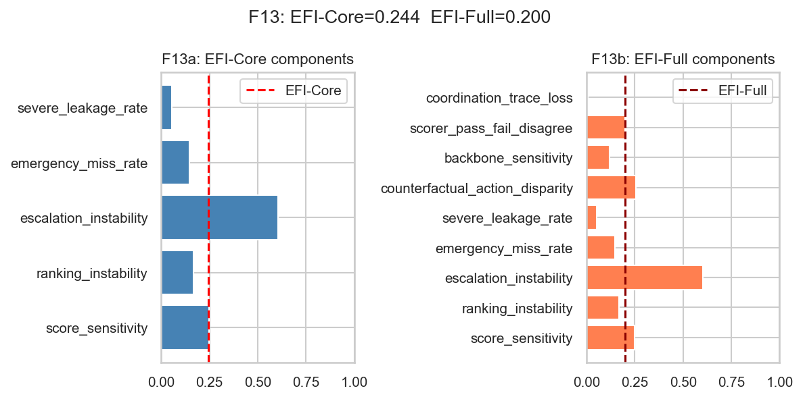

# PULSE-Care

**A measurement-validity audit of simulated-patient evaluation of clinical AI agents.**

Code and data for *PULSE-Care: A Measurement-Validity Audit of Simulated-Patient Clinical Agent
Evaluation* (AACL-IJCNLP 2026). [Paper: link coming soon]

LLM patient simulators are increasingly used to evaluate clinical AI agents. PULSE-Care asks
whether the conclusions of such evaluations (scores, model rankings, escalation decisions,
demographic counterfactuals) stay stable when the patient simulator, agent architecture,
simulator backbone, scorer, or random seed changes. It summarises the answer as two composite
indices, **EFI-Core** and **EFI-Full** (higher = less stable).



> **Disclaimer.** All clinical cases are synthetic and contain no patient data. This repository is
> a research tool for studying evaluation methodology. It is not a clinical system and must not be
> used for diagnosis, triage, or medical advice.

## Key results

Primary analysis set: 576 trajectories (24 cases × 4 simulators × 2 architectures × 3 models);
1,542 trajectories in total. 95% case-level bootstrap CIs.

| Metric | Value | 95% CI |
|---|---|---|
| Score sensitivity | 0.247 | [0.207, 0.290] |
| Ranking instability | 0.167 | [0.000, 0.222] |
| Escalation instability | 0.604 | [0.500, 0.701] |
| Emergency miss rate | 0.146 (14/96) | [0.082, 0.233] |
| Counterfactual action disparity vs. seed-only null | 0.257 vs. 0.255 | permutation p = 0.53 |
| **EFI-Core** | **0.244** | [0.202, 0.282] |
| **EFI-Full** | **0.200** | [0.174, 0.227] |

Metric definitions and further results are in [DETAILS.md](DETAILS.md).

## Quickstart

Python 3.10+.

```bash
python -m venv .venv
source .venv/bin/activate          # Windows: .venv\Scripts\activate
pip install -e . pytest
pytest -q tests/
```

### Reproduce the paper's tables and figures (no API keys needed)

All 1,542 trajectories and their scores are included in `outputs/`. This rebuilds every table
and figure from them in about 3 minutes:

```bash
python scripts/run_full_analysis.py
```

To find which file produced each table in the paper, see
[DETAILS.md → Paper tables](DETAILS.md#paper-tables). To run new experiments with your own API
keys, see [DETAILS.md → Running the pipeline](DETAILS.md#running-the-pipeline).

## Repository layout

```
cases/             24 synthetic 3-visit clinical cases (JSON)
simulator_cards/   patient-simulator behaviour definitions
prompts/           simulator, agent, scorer and judge prompts
configs/           experiment, model and scoring configuration
src/               simulation runner, model clients, metrics
scripts/           scoring, judging and analysis scripts
outputs/           trajectories, scores, tables, figures
```

Models: Claude Haiku 4.5, GPT-4o and Mistral Small 3.2 (extension runs use Mistral Small 4; see
[DETAILS.md](DETAILS.md#data-notes)).
 


## License

TODO: add a LICENSE file (e.g. MIT or Apache-2.0 for code, CC-BY-4.0 for cases and outputs).
